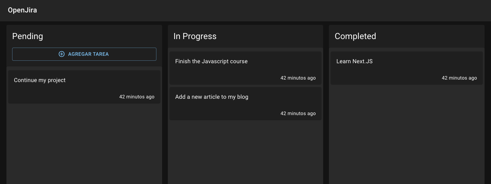

# Next.js: OpenJira App



The Open Jira App is a clone of the Jira or Trello App written entirely with Next.js and Typescript.
For this app we're leveraging all the things React, Next.js and Typescript have to offer as hooks, SSR, the router, getStaticProps, the strong typing and so.
For the Database it's being used MongoDB and Mongoose, and you'll need Docker to run it.
To build the UI, I used Material UI.

---
### Getting started 🚀
---
### Frontend

1. Clone this project
2. Go to the folder of the project `cd open-jira`
3. Install dependencies `yarn install`
4. Run the project in local environment `yarn dev`

### Backend

You need the DB to run locally
```
docker-compose up -d
```

MongoDB Local URL:
```
mongodb://localhost:27017
```

## Configure the environment variables
- Rename the file __.env.template__ to __.env__

## Fill the database with test information

Call to: (you can do it with postman)
```
http://localhost:3000/api/seed
```

### Deployment 📦
Once with all dependencies installed, you can make the build `yarn dev`

### This project was build with 🛠

- Next.js
- Typescript
- MongoDB

### Notes 🎉

- This project isn't finished yet
